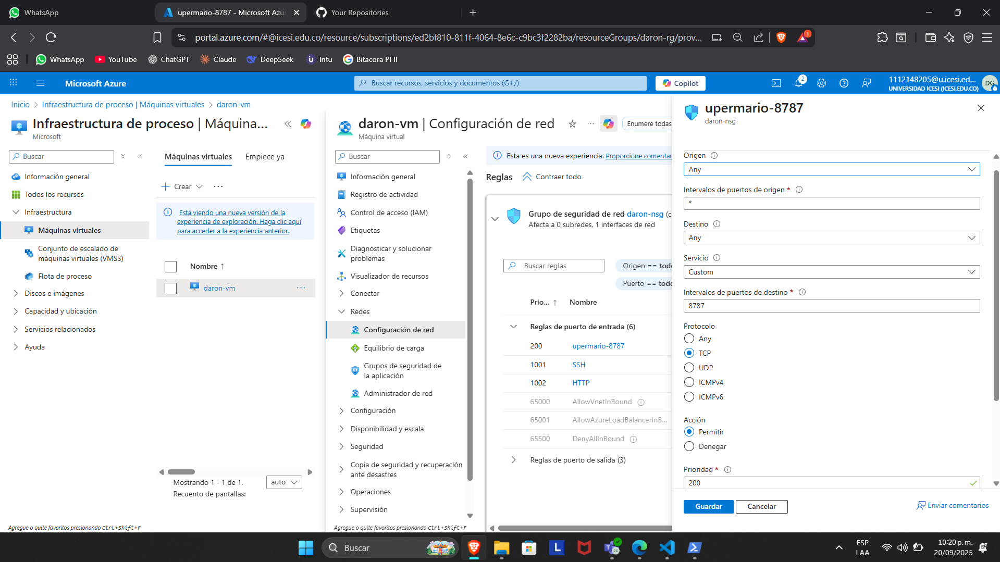
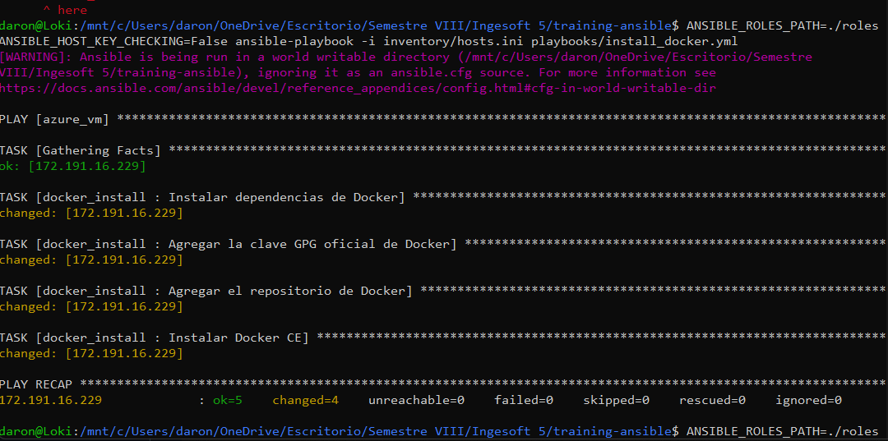
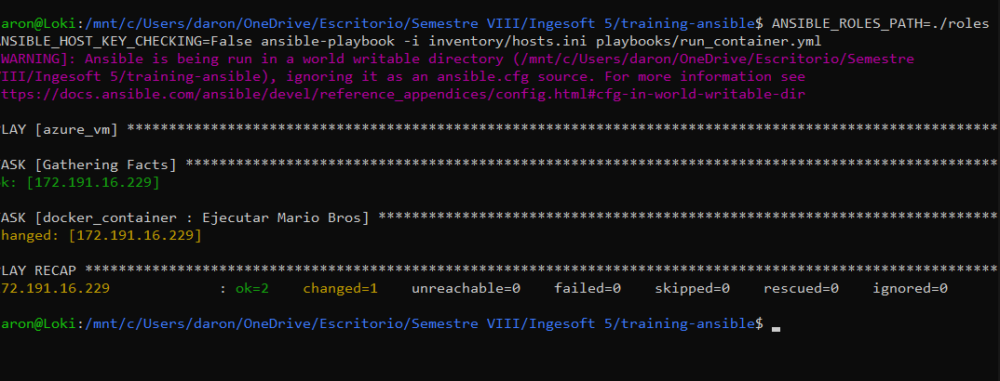
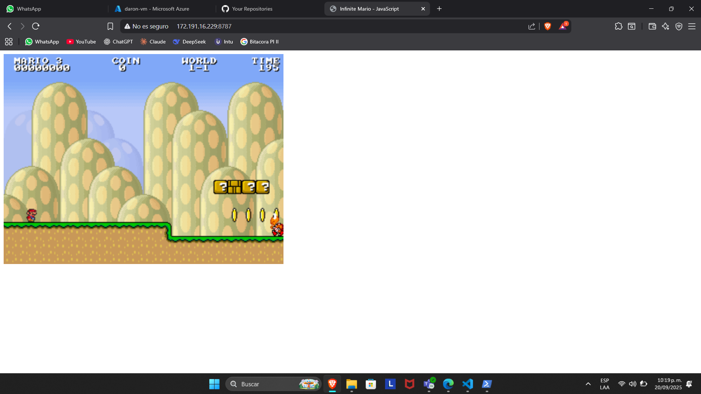

# Proyecto Ansible: Despliegue Automático de Mario Bros con Docker

Este proyecto demuestra el uso de Ansible para automatizar el proceso de configuración de un servidor, la instalación de Docker y el despliegue de una aplicación en contenedores (un juego clásico de Mario Bros) en una máquina virtual de Azure.

## 1. Descripción del Proyecto

El objetivo es utilizar Ansible para ejecutar dos playbooks principales:
- **`install_docker.yml`**: Prepara la máquina virtual instalando Docker y sus dependencias.
- **`run_container.yml`**: Descarga la imagen del juego desde Docker Hub y la ejecuta en un contenedor, exponiéndola en un puerto específico.

## 2. Prerrequisitos

- Una cuenta de Microsoft Azure con una máquina virtual Linux (Ubuntu) desplegada.
- Subsistema de Windows para Linux (WSL) instalado en la máquina local.
- Ansible y `sshpass` instalados en el entorno WSL (`sudo apt install ansible sshpass`).

## 3. Configuración

### 3.1. Inventario de Ansible

El archivo `inventory/hosts.ini` es el inventario donde se define la máquina virtual de destino. Es crucial actualizarlo con la IP pública, el nombre de usuario y la contraseña de la máquina virtual en Azure.

```ini
[azure_vm]
TU_IP_PUBLICA ansible_user=TU_USUARIO ansible_ssh_pass=TU_CONTRASEÑA
```

### 3.2. Regla de Red en Azure

Para que el juego sea accesible desde internet, es necesario abrir el puerto utilizado por el contenedor en el Grupo de Seguridad de Red (NSG) de la máquina virtual en Azure. En este caso, se configuró el puerto **8787**.

**Evidencia de la configuración en Azure:**




## 4. Ejecución de los Playbooks

Los siguientes comandos se ejecutan desde la terminal de WSL, en la raíz del proyecto. Se utilizan las variables de entorno `ANSIBLE_ROLES_PATH` y `ANSIBLE_HOST_KEY_CHECKING` para asegurar la correcta localización de los roles y evitar problemas de conexión SSH.

### 4.1. Instalación de Docker

Este comando ejecuta el playbook que instala Docker en la máquina virtual.

```bash
ANSIBLE_ROLES_PATH=./roles ANSIBLE_HOST_KEY_CHECKING=False ansible-playbook -i inventory/hosts.ini playbooks/install_docker.yml
```

**Evidencia de la ejecución:**



### 4.2. Ejecución del Contenedor

Este comando ejecuta el playbook que despliega el contenedor del juego.

```bash
ANSIBLE_ROLES_PATH=./roles ANSIBLE_HOST_KEY_CHECKING=False ansible-playbook -i inventory/hosts.ini playbooks/run_container.yml
```

**Evidencia de la ejecución:**


## 5. Verificación y Resultado Final

Una vez ejecutados ambos playbooks y configurada la regla de red, el juego es accesible a través de un navegador web en la siguiente URL:

`http://<TU_IP_PÚBLICA>:8787`

**¡Misión cumplida! El juego está desplegado y funcionando:**

